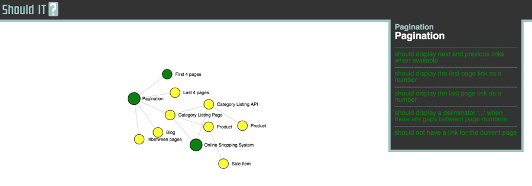
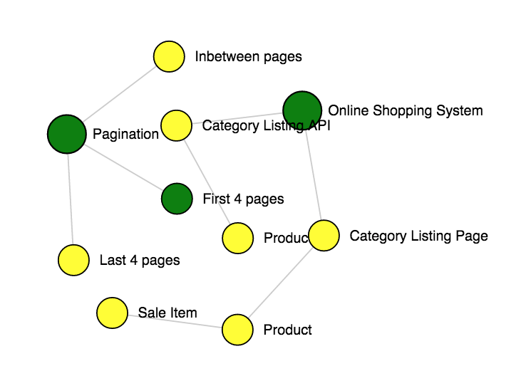
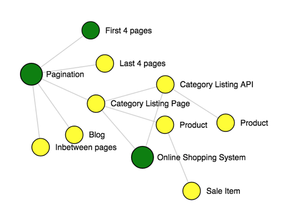

# Visualisation

## Semantic BDD



One of the main selling points of ShouldIT? is the ability to create a map of all of your features and to be able to a visualisation of the progress of your project including test outcomes. ShouldIT? will automatically know about your top level nested relationships and the semantic relationships between them.

## Feature Files

Write feature files as you normally would. The following is a sample subset of what a feature file for a shopping site might look like.

### category_listing.feature.md
```
# Online Shopping System

## Category Listing Page


+ IT should display the number of products found

### Product

+ IT should display a thumbnail 
+ IT should display the product name 
+ IT should display the price

#### Sale Item

+ IT should display the original price
- IT should prepend the price with Now
+ IT should display the discount as a percentage
  - eg 40% off
```

### category_listing_api.feature.md
```
# Online Shopping System

## Category Listing API

+ IT should contain an array of products
+ IT should contain the number of items found in the `totalItems` property as an integer

### Product

+ IT should contain a `title` property
+ IT should contain a `maker` property that is blank when not available
+ IT should contain a price in pence
+ IT should contain a thumbnail property for an image at 100px by 100px
```


### pagination.feature.md
```
# Pagination

+ IT should display next and previous links when available
+ IT should display the first page link as a number
+ IT should display the last page link as a number
+ IT should display a deliminator '...' when there are gaps between page numbers
+ IT should not have a link for the current page

## First 4 pages


+ IT should display up to the first 5 page numbers when available

## Inbetween pages


e.g if 17 pages total 5-13

+ IT should display 2 pages either side of the current page

## Last 4 pages


e.g if 17 pages total 14-17

+ IT should display the 5 last page numbers
```

### blog.feature.md
```
# Blog

We will very soon write some great features for our blog in here!
```

## Lets Visualise It!

Now we have all these babies we can start the web visualiser by the following command (make sure ShouldIT? is installed locally for visualisation):

```
shouldit --serve
```

You should now be able to see a wonderful of your project like this.



## Somethings missing!

Yes you will see that there is no information that the API is linked directly to the page. We also see that pagination also has no connection. Blog isn't even there at all! In order to see these extra relationships we use a map file.

## Map file

If in your `ShouldIT?` conf file you set a property like `{ map: 'features/map.yaml'}` you then have the ability to further express the relationships between features.

In Yaml you simply append a context to the node of another.

```yaml
Online Shopping System Category Listing Page:
    - Online Shopping System Category Listing API
    - Pagination
Blog:
    - Pagination
```

So in this case the `Online Shopping System Category Listing Page` has a dependency on 2 features:

 + Online Shopping System Category Listing API
 + Pagination

Where `Blog` is dependant on only the `pagination` feature.
 
By then adding this map your visualisation will show even further the relationship between the features.



## Updates to ShouldIT results

If you run ShouldIT? in watch mode then whenever you have your tests run or update your feature files then your project map will update automatically.

```
shouldit --serve --watch
```